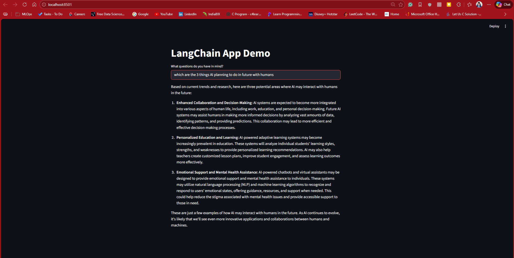

# GenAI Application using LangChain, Groq, Streamlit & FastAPI

This project is a simple Generative AI (GenAI) application built using LangChain and Groq LLM, with two interfaces:

1. Streamlit Web App (UI-based integration and interaction) - LangChain App Demo
2. FastAPI Web Application (API-based integration & interaction using Uvicorn) - 

The application is suitable for basic GenAI use cases such as:

Text generation
Question answering
Prompt-based interactions

### Note: This setup is not intended for RAG (Retrieval-Augmented Generation) using Groq’s free API. For RAG-based use cases, you will need a paid API key (e.g., OpenAI, Azure OpenAI, etc.). I'll cover end to end LLM application with RAG in another projects.

## Tech Stack

Python
GenAI
Promt Engineering, Chains, Models,APIs Integrations
LangChain
Groq API (Free Tier)
Streamlit
FastAPI
Uvicorn

## Project Structure (Example)
.
├── app_streamlit.py      # Streamlit web app
├── app_fastapi.py        # FastAPI backend
├── requirements.txt
├── .env
└── README.md

## Prerequisites

- Python 3.9+
- Groq API Key (Free)
- Create a .env file in the root directory:
- GROQ_API_KEY=your_groq_api_key_here

## Installation & Runs

Install all required dependencies:
```
pip install -r requirements.txt
```
Run the Streamlit App
```
streamlit run app_streamlit.py
```

Then open your browser at:

http://localhost:8501

See the application runing:



============================================

## Run the FastAPI Application
uvicorn app_fastapi:app --reload


API will be available at:

http://localhost:8000


Swagger UI:

http://localhost:8000/docs

🆓 Groq Free API – Important Limitations

Works well for basic prompt-based GenAI

❌ Not reliable for RAG (document embeddings, vector search, large context pipelines)

❌ No persistent vector database support

💡 RAG Support (Important Note)

If you want to build RAG-based applications, you will need:

A paid LLM API (OpenAI / Azure OpenAI / Anthropic)

Embedding models
Vector databases (FAISS, Pinecone, Chroma, etc.)
Groq free API is not recommended for production-grade RAG pipelines.

## Use Cases Covered

- GenAI demos
- Learning LangChain basics
- LLM API integration
- Streamlit + FastAPI practice
- Rapid prototyping
- Prompt Engineering
- Chains - Chaining the more than 3 objects to an same response to give response
- LLMsFoundational Models tweaking
- RAG-Retrival Augmentation Generation

## Disclaimer:
This project is for learning and experimentation purposes only.
Not recommended for production without proper API limits, monitoring, and paid LLM access.

## Acknowledgements
LangChain
Groq
Streamlit
FastAPI